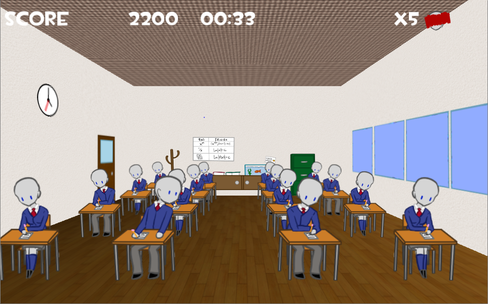
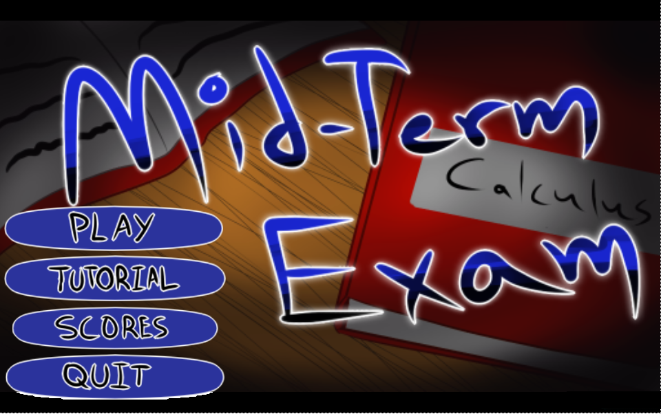
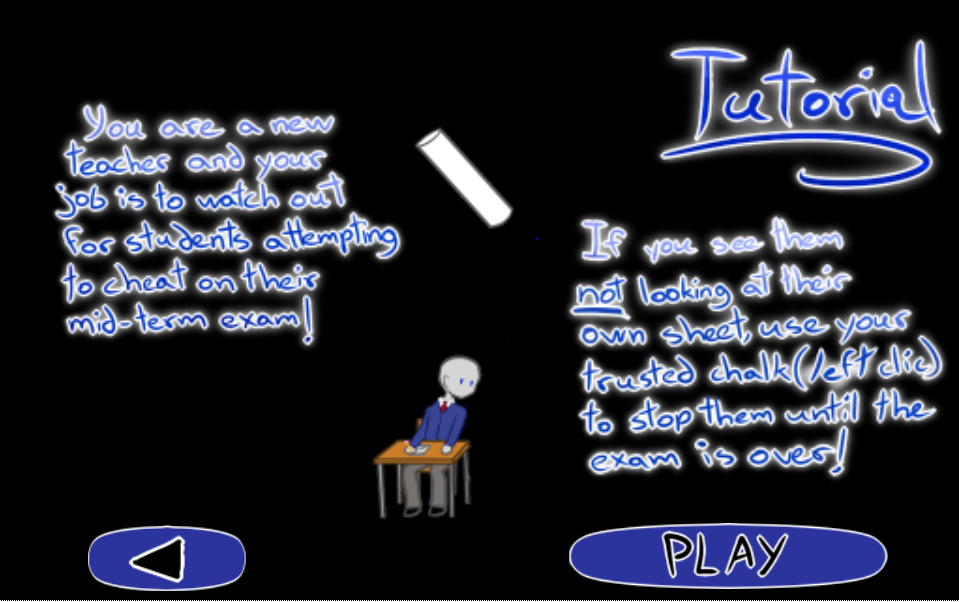

# GreatParanoidTeacher 
## (a.k.a. Mid-term Exam)
WonderJam UQAC 02/2015

##Description

A little shooting/rhythmic game made for the WonderJam of February with Unity3D.

[Play-it here!](http://corentin-r.github.io/Apps/GPT/test-build-GPT.html) (Windows only, Unity plugin needed =( )
##Story

You are a new teacher and you job is to watch out for students atempting to cheat on their mid-term exam!
If you see them not looking at their own sheet, use your trusted chalk to stop them until the exam is over. But be careful to your own stress too.

##Controls

Left Click to throw a chalk.

##Screenshots

##Authors
* Véronique GODIN
* Steven GERARD
* Steven FOUGERON
* Yannis M'RAD
* Omar WALDMANN
* Corentin RAOULT
